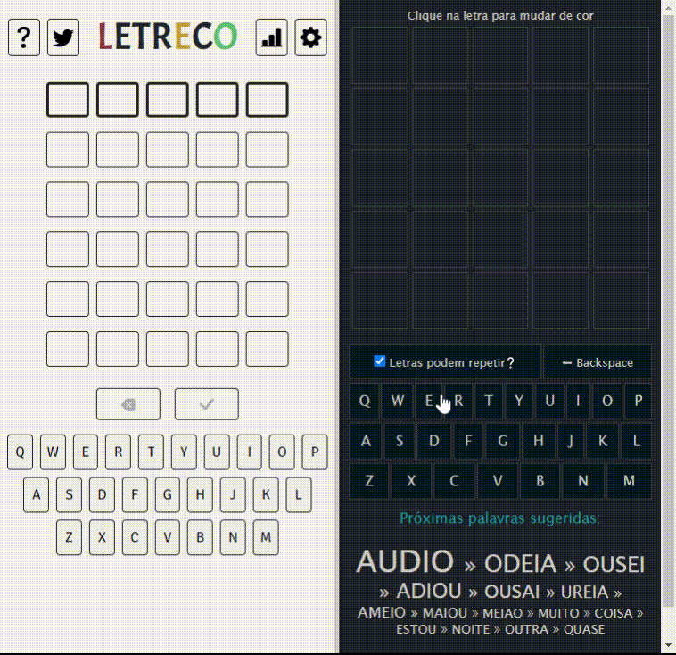

# Me ajuda nas 5
Te ajuda a descobrir a palavra do dia no Termo, Letreco, Palavrês e similares.

## Demo
[https://meajudanas5.netlify.app](https://meajudanas5.netlify.app)

## Rodar localmente com servidor web nodejs
- Instale o http-server digitando `npm install -g http-server`
- Navegue até o diretório `src`
- Rode o comando `http-server -c-1`
- Acesse o site em http://127.0.0.1:8080/